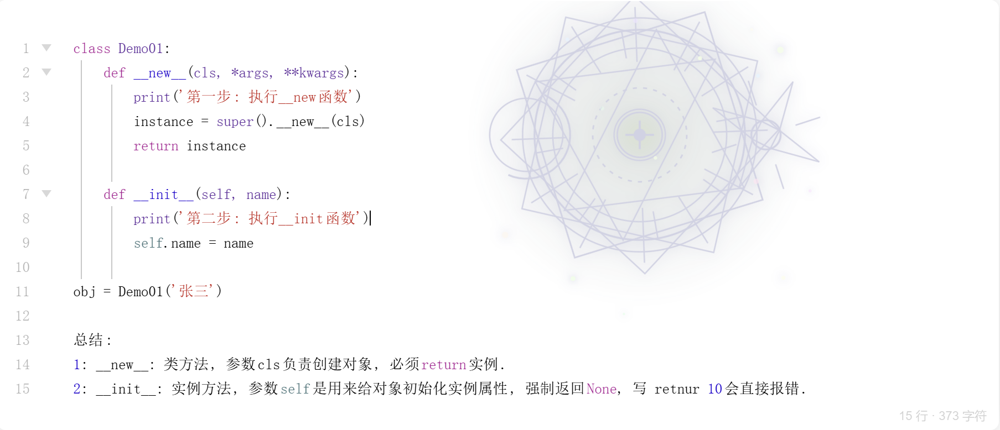
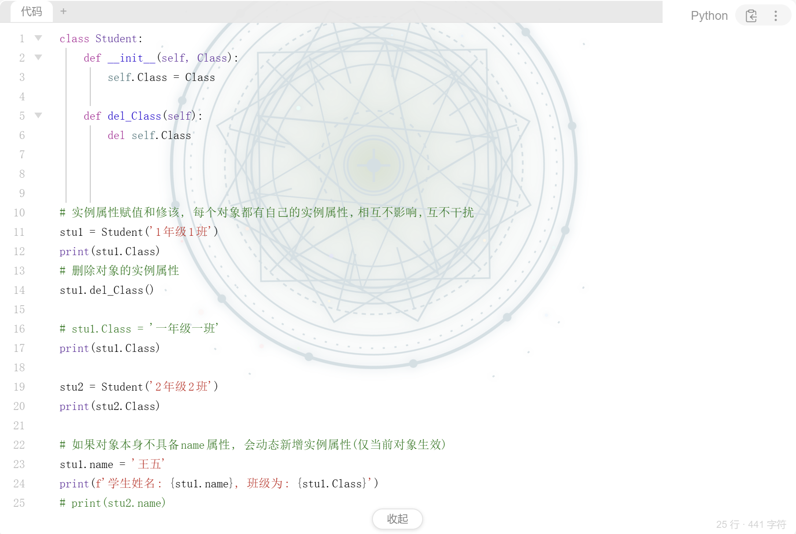

# Code Block Beautify（思源笔记代码块美化）

一款让思源笔记的代码块更漂亮、更好用的插件：**圆角边框、背景美化、当前行高亮、长代码折叠、语法高亮主题**，全部功能均可在设置面板中自定义。

## 截图





## 功能特性

### 🎨 视觉美化
- **圆角 / 边框 / 阴影**：圆角可调、边框宽度与颜色自定义、阴影支持正负值（正数 = 上凸浮起，负数 = 下凹内嵌）
- **边框样式**：实线、像素游戏（真像素块点阵）、虚线、手绘感（宽度不均的笔画）

### 🖼 背景美化
- **背景颜色 / 背景图片**：自定义背景色；支持本地图片上传、自动虚化、可调遮罩透明度，不影响代码阅读
- **背景主题**：网格纸、点阵、横线本、竖线本、交叉网格、虚线网格、斜纹、笔记本页、碳纤维、小方格纸等 10 种 CSS 纹理

### ⌨ 代码
- **当前行高亮**：跟随输入光标，高亮颜色可自定义
- **代码统计角标**：代码块底部显示行数 / 字符数
- **代码字体**：支持常见等宽字体（Consolas / Cascadia Code / JetBrains Mono / Fira Code），默认跟随主题
- **思源原生行号**：直接复用思源内置行号开关

### 📜 长代码折叠
- 超过设定行数自动显示「收起」按钮，收起后仅显示前 N 行
- 收起后自动滚动到代码块第一行居中，直接看到折叠效果
- 滚动预览、折叠状态持久化、收起时按钮虚化

### 🗂 顶部主题装饰栏
- Mac（红黄绿圆点）/ Windows（窗口按钮）/ Ubuntu（橙黄绿圆点）/ Chrome（标签页）四种风格
- 兼容思源原生右上角工具（语言标签 / 复制 / 更多）

### ✨ 语法高亮主题
- 内置 12 种 highlight.js 主题，可覆盖思源默认

## 安装

### 方式一：思源市场（推荐）
思源笔记 → 设置 → 集市 → 插件 → 搜索「Code Block Beautify」→ 安装。

### 方式二：手动安装
1. 从 [GitHub Releases](https://github.com/dyzlog/SiYuan-code-block-beautify/releases) 下载 `package.zip`
2. 思源笔记 → 设置 → 集市 → 手动安装 → 选择 zip 文件

## 设置说明

设置面板按分组组织，全部设置即时生效、自动保存：

| 分组 | 内容 |
| --- | --- |
| 外观 | 圆角、边框宽度、边框颜色、边框样式、阴影（正/负）、代码字体 |
| 背景 | 背景颜色、背景图片（上传/删除/虚化/遮罩）、背景主题 |
| 代码 | 当前行高亮（颜色）、代码统计角标、思源原生行号、长代码折叠（阈值） |
| 语法高亮 | 内置主题选择 |
| 主题风格 | 顶部装饰栏开关与风格 |

> 「恢复默认设置」可一键还原所有参数。

## 开发

```bash
npm install --legacy-peer-deps
npm run build    # 构建产物在 dist/ 下（package.zip）
```

## 许可

MIT
